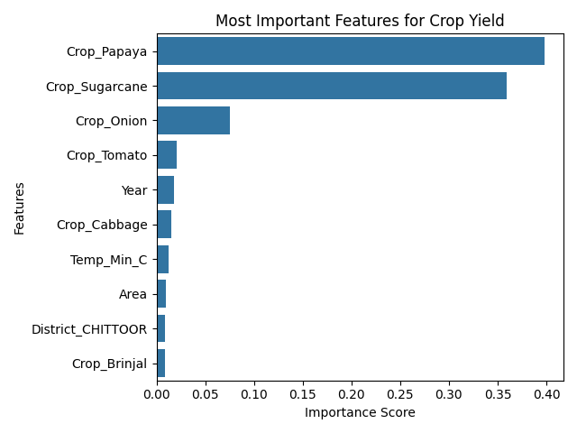
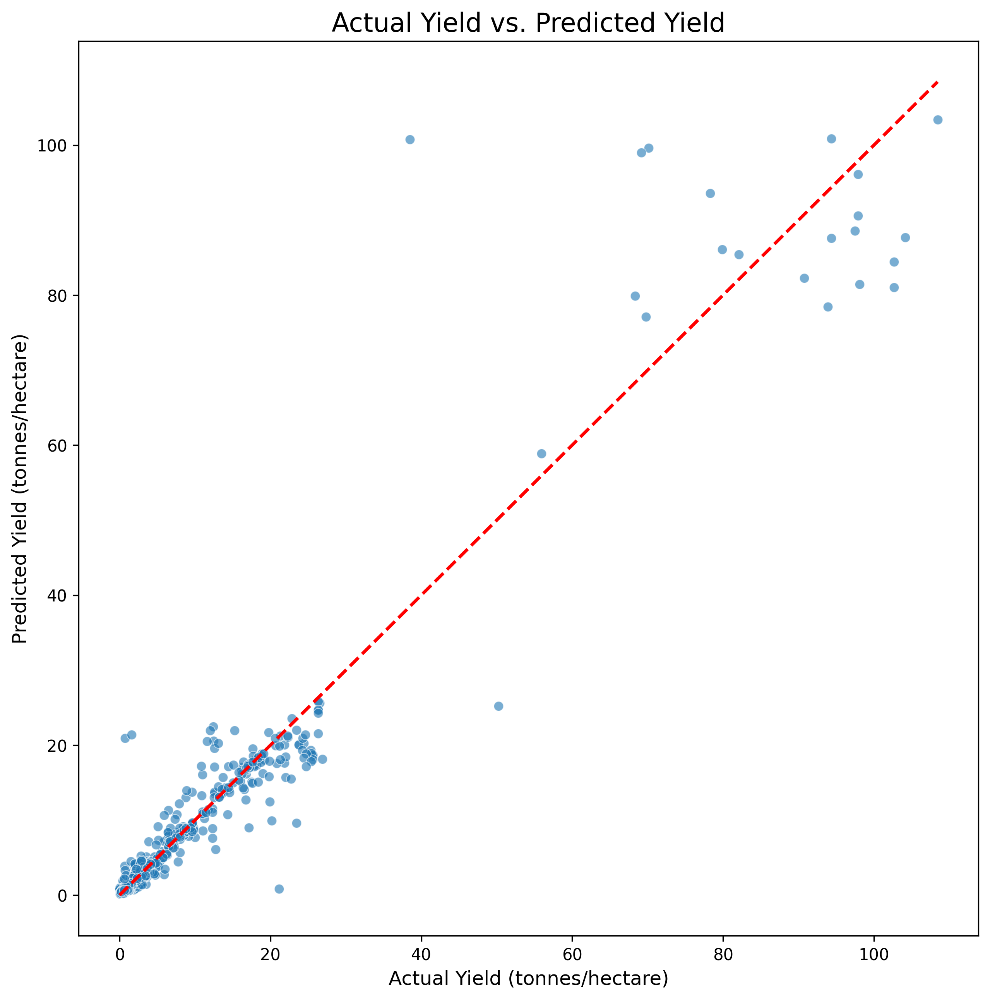

# Agricultural Yield Prediction for Andhra Pradesh

A data science project to predict crop yields using historical weather and production data, featuring a trained machine learning model and an interactive web application.

---

## Project Overview

This project addresses the critical challenge of predicting agricultural yields, a vital factor for food security and economic planning in Andhra Pradesh. By leveraging historical district-wise crop production data and corresponding weather metrics, this project develops a machine learning model capable of forecasting crop yields with high accuracy. The final model is deployed in an interactive web application built with Streamlit.

### Key Features

* **Data-Driven Prediction:** Utilizes a `RandomForestRegressor` model trained on years of historical data.
* **High Accuracy:** Achieved an **R-squared (R²) score of 0.92**, meaning the model explains 92% of the variance in crop yield.
* **Key Insight Generation:** Identifies the most influential factors affecting crop yield through feature importance analysis.
* **Interactive Web App:** A user-friendly interface built with Streamlit allows for "what-if" scenario analysis.

---

## Visual Demo

#### Key Analytical Plots

| Feature Importance Plot                                      | Actual vs. Predicted Plot                                      |
| ------------------------------------------------------------ | -------------------------------------------------------------- |
|            |          |
| *This plot shows that crop type is the dominant predictor of yield.* | *This plot visually confirms the model's high accuracy (R² = 0.93).* |

#### Interactive Web Application

<!--  -->

---

## Technologies Used

* **Programming Language:** Python 3.9
* **Data Manipulation:** Pandas, NumPy
* **Machine Learning:** Scikit-learn (`RandomForestRegressor`)
* **Data Visualization:** Matplotlib, Seaborn
* **Web Application:** Streamlit
* **Data Collection:** `requests` (for weather API)

---

## Methodology

1.  **Data Collection:**
    * Gathered historical crop production data from `data.gov.in`.
    * Fetched corresponding historical daily weather data (rainfall, min/max temperature) for each district from the Open-Meteo API.

2.  **Data Preprocessing & Feature Engineering:**
    * Cleaned and merged the two datasets.
    * Calculated the target variable **Yield** (Production / Area).
    * Aggregated daily weather data into seasonal metrics (e.g., total seasonal rainfall, average seasonal temperature).

3.  **Model Training & Evaluation:**
    * Trained a `RandomForestRegressor` model on the prepared dataset.
    * Evaluated the model on a held-out test set to ensure its performance generalizes to new data.

4.  **Interactive Web App:**
    * Saved the trained model and required data columns.
    * Built a user-friendly interface with Streamlit to allow for real-time predictions based on user inputs.

---

## Results & Key Insights

The final model achieved excellent performance on the test set:

* **Mean Absolute Error (MAE):** 0.76 tonnes/hectare
* **R-squared (R²):** 0.92

The feature importance analysis revealed that **the specific crop type is the most dominant predictor of yield**. High-value, high-yield crops like Papaya and Sugarcane have inherently different yields than staple crops, and this factor overshadowed the more subtle (though still significant) effects of weather and location.

---

## How to Run This Project

To run this project on your local machine, follow these steps:

1.  **Clone the Repository**
    ```bash
    git clone [https://github.com/your-username/your-repo-name.git](https://github.com/your-username/your-repo-name.git)
    cd your-repo-name
    ```

2.  **Install Dependencies**
    It's recommended to create a virtual environment first. Then, install the required packages.
    ```bash
    pip install -r requirements.txt
    ```

3.  **Run the Streamlit App**
    Execute the following command in your terminal:
    ```bash
    streamlit run app.py
    ```
    Your web browser will automatically open with the application running.

---